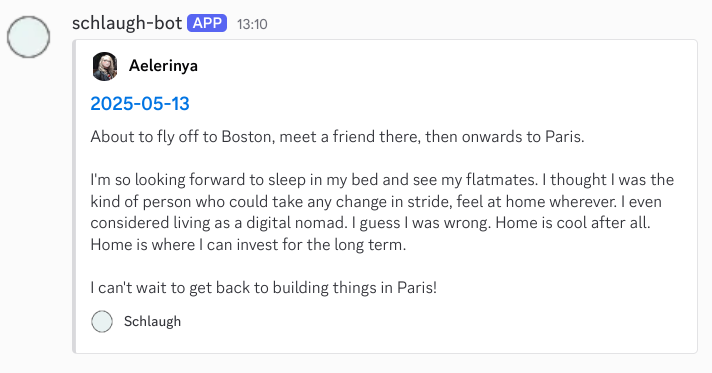

# Schlaugh Bot

A bot that posts my latest schlaupdate to my Discord server.

I computed the schlaupdate to be at 9 AM UTC, so the bot runs at 9:10 AM UTC.

The bot uses [Cloudflare Workers](https://developers.cloudflare.com/workers/) as the runtime with a [cron trigger](https://developers.cloudflare.com/workers/configuration/cron-triggers/#supported-cron-expressions). Cloudflare free plan is sufficient for this use case.

## Configuration

For now, the values are hardcoded, so you'll need to edit the code to change the webhook URL and the user ID.

## Deployment

```bash
npx wrangler deploy
```

## What it looks like

